Feature Selection
================
Kathy Trieu

Fall 2023

### R Setup

``` r
rm(list = ls()); gc()
```

    ##          used (Mb) gc trigger (Mb) max used (Mb)
    ## Ncells 458468 24.5     987785 52.8   644245 34.5
    ## Vcells 821149  6.3    8388608 64.0  1635327 12.5

``` r
pacman::p_load(tidyverse,wesanderson)
```

### Load and Organize Data

``` r
df = read.csv('data/CPL_Cleaned_Data.csv')

locationID = df$Location
year       = df$Year

df = df %>%
  select(-X, -Location, -Year) %>%
  sapply(., as.numeric) %>% as.data.frame(.) %>%
  mutate(Location = locationID,
         Year     = year) %>%
  select(Location, Year, everything())

dataUnreliable = c("SANJUANBAUTISTACITYLIBRARY","ALPINECOUNTYLIBRARY/ARCHIVES",
                   "VERNONPUBLICLIBRARY","TEHAMACOUNTYLIBRARY")
```

### Remove Unreliable Data

#### I manually checked for values that did not make sense and removed rows that included primarily unreliable data.

``` r
df = df %>%
  filter(!(Location %in% dataUnreliable)) %>%
  filter(!(Location == "SOUTHSANFRANCISCOPUBLICLIBRARY" & Year == "20-21")) %>%
  filter(!(Location == "COLTONPUBLICLIBRARY" & Year == "19-20"))
```

### Standardize Features

``` r
df = df %>%
  mutate(TotalProgramAttendancePerProgram      = TotalProgramAttendance/NumofPrograms,
         AdultProgramAttendancePerProgram      = AdultProgramAttendance/NumofAdultPrograms,
         YoungAdultProgramAttendancePerProgram = YoungAdultProgramAttendance/NumofYoungAdultPrograms,
         ChildrenProgramAttendancePerProgram   = ChildrensProgramAttendance/NumofChildrensPrograms,
         .keep ="all") 

df[is.na(df)]  = 0
leaveAloneVars = c("Location","Year","CIPACompliant",
                   "PopulationofTheLegalServiceArea",
                   "TotalProgramAttendancePerProgram",
                   "AdultProgramAttendancePerProgram",
                  "YoungAdultProgramAttendancePerProgram",
                   "ChildrenProgramAttendancePerProgram")
LibraryVisits = df$LibraryVisits

# Set Aside Dataframes for EDA later.
dfNotRates = df
dfRatesExceptLibraryVisits = df %>%
  select(-LibraryVisits) %>%
  mutate(across(-all_of(leaveAloneVars),.fns=~./PopulationofTheLegalServiceArea)) %>%
  mutate(LibraryVisits = LibraryVisits)

df = df %>%
  mutate(across(-all_of(leaveAloneVars),.fns=~./PopulationofTheLegalServiceArea))
```

### Check Skewness

``` r
skewnessVec = df %>%
  select(-Location, -Year) %>%
  sapply(., e1071::skewness, na.rm=TRUE)
```

### Perform Cluster Analysis

``` r
threeColors = wes_palette("Darjeeling1", 3, type = "discrete")
oneColor    = wes_palette("Darjeeling1", 1, type = "discrete")

n_clusters = 10
wss        = numeric(n_clusters)

for (i in 1:n_clusters) {
  km.out <- kmeans(df[,-c(1,2)], centers = i, nstart = 20)
  wss[i] <- km.out$tot.withinss
}

wss_df     = tibble(clusters = 1:n_clusters, wss = wss)
scree_plot = ggplot(wss_df, aes(x = clusters, y = wss, group = 1)) +
                geom_point(size = 4)+
                geom_line() +
                scale_x_continuous(breaks = c(2, 4, 6, 8, 10)) +
                xlab('Number of clusters')
scree_plot
```

<!-- -->

``` r
k      = 2
km.out = kmeans(df[,-c(1,2)], centers = k, nstart = 20)

factoextra::fviz_cluster(km.out, data = df[,-c(1,2)],
             geom = "text",
             ggtheme = theme_bw(),
             ellipse.type = "convex") +
           theme_minimal() +
           scale_fill_manual(values = wes_palette("Darjeeling1", 2, type = "discrete")) +
           scale_color_manual(values = wes_palette("Darjeeling1", 2, type = "discrete"))
```

<!-- -->

### Used Cluster Analysis Information to Split Data Meaningfully

#### Cluster analysis revealed two distinct clusters: one large cluster of small to large libraries and one cluster of extra large libraries. All data from libraries serving extra large communities were removed using Outlier criteria.

``` r
df$cluster = km.out$cluster
findOutlier = function(x) {
  return(x < quantile(x, .25) - 1.5*IQR(x) | x > quantile(x, .75) + 1.5*IQR(x))
}
```

### Created new dataframes to simplify Exploratory Data Analysis (EDA)

``` r
dfnoOutliers = df %>%
  filter(!findOutlier(df$PopulationofTheLegalServiceArea)==TRUE) %>%
  select(-cluster)

dfRatesWithClassifier = df %>%
  mutate(Neighborhood = ifelse(findOutlier(df$PopulationofTheLegalServiceArea), "Large", "Small")) %>%
  mutate(Neighborhood = ifelse((PopulationofTheLegalServiceArea > 3000000), "Extra Large", Neighborhood))

dfRatesWithClassifier.LV = dfRatesExceptLibraryVisits %>%
  mutate(Neighborhood = ifelse(findOutlier(df$PopulationofTheLegalServiceArea), "Large", "Small")) %>%
  mutate(Neighborhood = ifelse((PopulationofTheLegalServiceArea > 3000000), "Extra Large", Neighborhood))

dfNotRatesWithClassifier = dfNotRates %>%
  mutate(Neighborhood = ifelse(findOutlier(df$PopulationofTheLegalServiceArea), "Large", "Small")) %>%
  mutate(Neighborhood = ifelse((PopulationofTheLegalServiceArea > 3000000), "Extra Large", Neighborhood))

ProgramAttendancePerProgram = dfRatesWithClassifier %>%
  select(PopulationofTheLegalServiceArea, Neighborhood, contains("AttendancePerProgram")) %>%
  select(-TotalProgramAttendancePerProgram) %>%
  mutate("Adults" = AdultProgramAttendancePerProgram,
         "Children" = ChildrenProgramAttendancePerProgram,
         "Young Adults" = YoungAdultProgramAttendancePerProgram) %>%
  gather(key = "AgeGroup", value = "Attendance", 
         "Adults", "Young Adults", "Children") %>%
  select(-AdultProgramAttendancePerProgram,-ChildrenProgramAttendancePerProgram,-YoungAdultProgramAttendancePerProgram)

dfNotRates_NoOutliers = dfNotRates %>%
  filter(!findOutlier(df$PopulationofTheLegalServiceArea)==TRUE)

dfNotRates_Outliers = dfNotRates %>%
  filter(findOutlier(df$PopulationofTheLegalServiceArea)==TRUE)

dfOutliers = df %>%
  filter(findOutlier(df$PopulationofTheLegalServiceArea)==TRUE)

neighborhoodCount = dfNotRatesWithClassifier %>%
  group_by(Neighborhood) %>%
  summarise(n = n()) 

totalLibraryVisits = dfNotRatesWithClassifier %>%
  group_by(Year, Neighborhood) %>%
  summarise(TotalLibraryVisits = sum(LibraryVisits)) 

totalProgramAttendance = dfNotRatesWithClassifier %>%
  group_by(Year, Neighborhood) %>%
  summarise(TotalProgramAttendance = sum(TotalProgramAttendance)) 

neighborhoodCount_R = dfRatesWithClassifier %>%
  group_by(Neighborhood) %>%
  summarise(n = n()) 

totalProgramAttendance_R = dfRatesWithClassifier %>%
  group_by(Year, Neighborhood) %>%
  summarise(TotalProgramAttendance = sum(TotalProgramAttendance)) 
```

### Data Visualizations

``` r
ggplot(dfNotRatesWithClassifier, aes(LibraryVisits/1000000, fill=Neighborhood,color=Neighborhood)) +
  geom_density(alpha=0.1) +
  scale_fill_manual(values = threeColors) +
  scale_color_manual(values = threeColors) +
  labs(title = "Library Visits (millions)",
       x = "Library Visits (millions)") +
  theme_minimal()
```

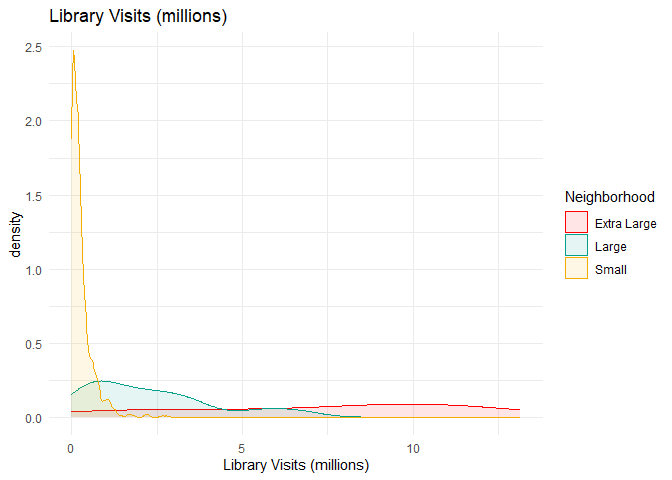<!-- -->

``` r
ggplot(dfRatesWithClassifier, aes(LibraryVisits, fill=Neighborhood,color=Neighborhood)) +
  geom_density(alpha=0.1) +
  scale_fill_manual(values = threeColors) +
  scale_color_manual(values = threeColors) +
  labs(title = "Average Library Visits Per Person",
       x = "Average Library Visits Per Person") +
  theme_minimal()
```

<!-- -->

``` r
ggplot(totalLibraryVisits) +
  geom_col(aes(x=Year, y=TotalLibraryVisits/1000000, fill=Neighborhood),position="dodge") +
  scale_fill_manual(values = threeColors) +  # Set fill colors manually
  labs(title = "Visits to All Libraries",
       x = "Year", y = "Total Library Visits (millions)") +
  theme_minimal()
```

<!-- -->

``` r
ggplot(totalProgramAttendance) +
  geom_col(aes(x=Year, y=TotalProgramAttendance/1000000, fill=Neighborhood),position="dodge") +
  scale_fill_manual(values = threeColors) +  # Set fill colors manually
  labs(title = "Total Program Attendance",
       x = "Year", y = "TotalProgramAttendance/ (millions)") +
  theme_minimal()
```

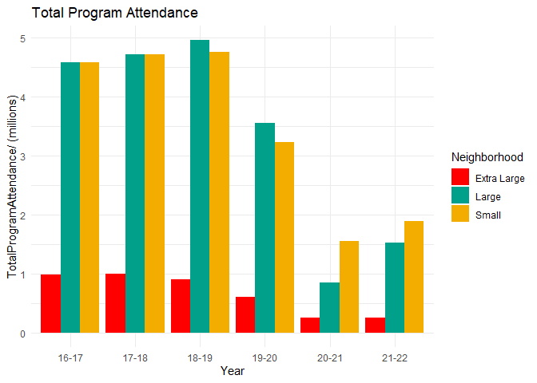<!-- -->

``` r
ggplot(dfRatesWithClassifier.LV) +
  geom_point(aes(x=PopulationofTheLegalServiceArea/1000000, y=LibraryVisits/1000000, color=Neighborhood),position="jitter") +
  scale_color_manual(values = threeColors) +  # Set fill colors manually
  labs(title = "Library Visits and Population Size",
       x = "Population of the Legal Service Area (millions)", y = "Library Visits (millions)") +
  theme_minimal()
```

<!-- -->

``` r
ggplot(dfRatesWithClassifier%>%filter(Neighborhood=="Small")) +
  geom_point(aes(x=PopulationofTheLegalServiceArea/1000, y=TotalProgramAttendancePerProgram),
             position="dodge", color="#F2AD00") +
  labs(title = "Average Attendance Per Program",
       x = "Population of the Legal Service Area (thousands)", y = "Average Attendance Per Program") +
  theme_minimal()
```

    ## Warning: Width not defined
    ## ℹ Set with `position_dodge(width = ...)`

<!-- -->

``` r
ggplot(ProgramAttendancePerProgram%>%filter(Neighborhood=="Small")) +
  geom_point(aes(x=PopulationofTheLegalServiceArea/1000, y=Attendance, color=AgeGroup),
             position="jitter") +
  scale_color_manual(values = threeColors) +
  labs(title = "Average Attendance Per Program",
       x = "Population of the Legal Service Area (thousands)", y = "Average Attendance Per Program") +
  theme_minimal()
```

<!-- -->

``` r
ggplot(ProgramAttendancePerProgram %>% filter(Neighborhood == "Small")) +
  geom_boxplot(aes(x = AgeGroup, y = Attendance, color = AgeGroup)) +
  scale_color_manual(values = threeColors) +
  labs(title = "Average Attendance Per Program",
       x = "Age Group",
       y = "Average Attendance Per Program") +
  theme_minimal() +
  guides(color = "none")
```

<!-- -->

``` r
ggplot(dfRatesWithClassifier.LV) +
  geom_point(aes(x=LibraryVisits/1000000, y=AnnualUsesofPublicInternetComputers, color=Neighborhood),
             position="jitter") +
  scale_color_manual(values = threeColors) +
  labs(title = "Computer Use Per Person and Library Visits",
       x = "Library Visits (millions)", y = "Annual Uses of Public Computers Per Person") +
  theme_minimal()
```

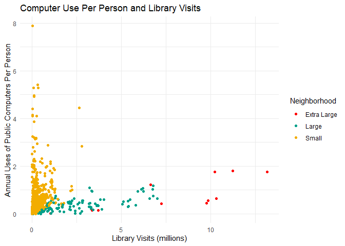<!-- -->

``` r
ggplot(dfRatesWithClassifier.LV %>% filter(Neighborhood == "Small")) +
  geom_point(aes(x=LibraryVisits/1000000, y=AnnualUsesofPublicInternetComputers, color=Neighborhood),
             position="jitter", color="#F2AD00") +
  labs(title = "Computer Use Per Person and Library Visits",
       x = "Library Visits (millions)", y = "Annual Uses of Public Computers Per Person") +
  theme_minimal()
```

<!-- -->

``` r
ggplot(dfRatesWithClassifier.LV %>% filter(Neighborhood == "Extra Large")) +
  geom_point(aes(x=LibraryVisits/1000000, y=AnnualUsesofPublicInternetComputers, color=Neighborhood),
             position="jitter", color=oneColor) +
  labs(title = "Computer Use Per Person and Library Visits",
       x = "Library Visits (millions)", y = "Annual Uses of Public Computers Per Person") +
  theme_minimal()
```

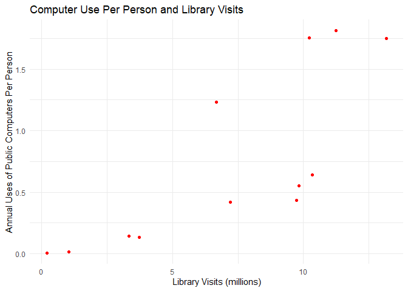<!-- -->

``` r
ggplot(dfRatesWithClassifier.LV %>% filter(Neighborhood == "Large")) +
  geom_point(aes(x=LibraryVisits/1000000, y=AnnualUsesofPublicInternetComputers, color=Neighborhood),
             position="jitter", color="#00A08A") +
  labs(title = "Computer Use Per Person and Library Visits",
       x = "Library Visits (millions)", y = "Annual Uses of Public Computers Per Person") +
  theme_minimal()
```

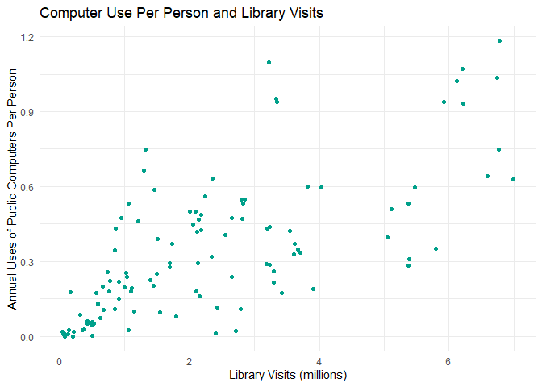<!-- -->

``` r
ggplot(dfNotRatesWithClassifier %>% filter(Neighborhood == "Small")) +
  geom_point(aes(y=PopulationofTheLegalServiceArea/1000000, x=NumofElectronicCollections, color=Neighborhood),
             position="jitter", color="#F2AD00") +
  labs(title = "Electronic Collections Per Person and Library Visits",
       x = "Population of the Legal Service Area (millions)", y = "Electronic Collections Per Person") +
  theme_minimal()
```

<!-- -->

``` r
ggplot(dfRatesWithClassifier.LV %>% filter(Neighborhood == "Extra Large")) +
  geom_point(aes(x=LibraryVisits/1000000, y=NumofElectronicCollections, color=Neighborhood),
             position="jitter", color=oneColor) +
  labs(title = "Electronic Collections Per Person and Library Visits",
       x = "Library Visits (millions)", y = "Electronic Collections Per Person") +
  theme_minimal()
```

<!-- -->

``` r
ggplot(dfRatesWithClassifier.LV %>% filter(Neighborhood == "Large")) +
  geom_point(aes(x=LibraryVisits/1000000, y=NumofElectronicCollections, color=Neighborhood),
             position="jitter", color="#00A08A") +
  labs(title = "Electronic Collections Per Person and Library Visits",
       x = "Library Visits (millions)", y = "Electronic Collections Per Person") +
  theme_minimal()
```

<!-- -->

#### More Data Visualizations, in the form of Box Plots

``` r
ggplot(dfRatesWithClassifier.LV %>% filter(Neighborhood == "Small")) +
  geom_boxplot(aes(y=AnnualUsesofPublicInternetComputers, color=Neighborhood),
               color="#F2AD00") +
  labs(title = "Computer Use Per Person and Library Visits",
       x = "Library Visits (millions)", y = "Annual Uses of Public Computers Per Person") +
  theme_minimal() +
  coord_cartesian(ylim=c(0,1))
```

<!-- -->

``` r
ggplot(ProgramAttendancePerProgram) +
  geom_boxplot(aes(x = Neighborhood, y = Attendance, color = Neighborhood)) +
  scale_color_manual(values = threeColors) +
  labs(title = "Average Attendance Per Program",
       x = "Neighborhood",
       y = "Average Attendance Per Program") +
  theme_minimal() +
  guides(color = "none")
```

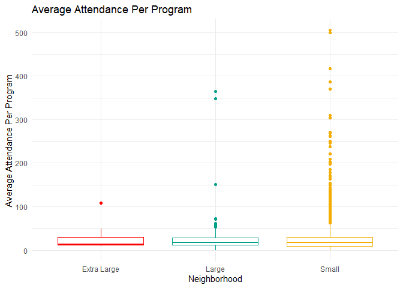<!-- -->

``` r
ggplot(ProgramAttendancePerProgram) +
  geom_boxplot(aes(x = Neighborhood, y = Attendance, color = Neighborhood)) +
  scale_color_manual(values = threeColors) +
  labs(title = "Average Attendance Per Program (Zoomed Into the Median)",
       x = "Neighborhood",
       y = "Average Attendance Per Program") +
  theme_minimal() +
  guides(color = "none") +
  coord_cartesian(ylim=c(0,50))
```

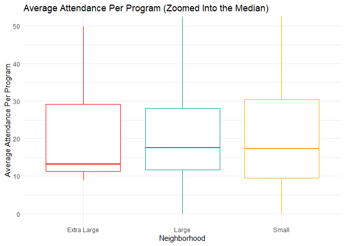<!-- -->

``` r
ggplot(ProgramAttendancePerProgram %>% filter(AgeGroup == "Adults")) +
  geom_boxplot(aes(x = Neighborhood, y = Attendance, color = Neighborhood)) +
  scale_color_manual(values = threeColors) +
  labs(title = "Average Attendance Per Adult Program",
       x = "Neighborhood",
       y = "Average Attendance Per Program") +
  theme_minimal() +
  guides(color = "none")
```

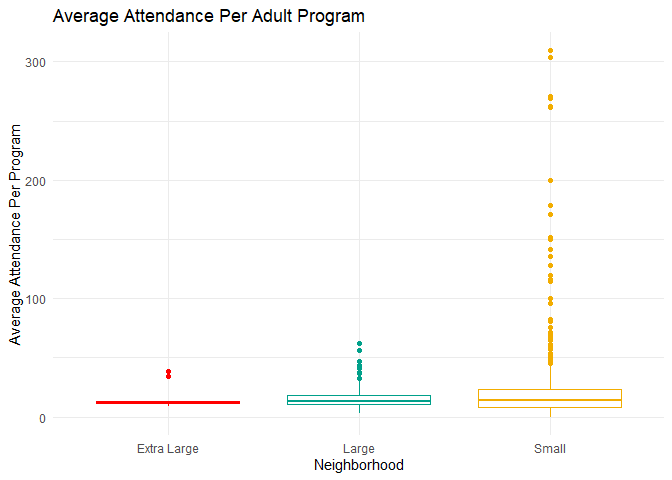<!-- -->

``` r
ggplot(ProgramAttendancePerProgram %>% filter(AgeGroup == "Adults")) +
  geom_boxplot(aes(x = Neighborhood, y = Attendance, color = Neighborhood)) +
  scale_color_manual(values = threeColors) +
  labs(title = "Average Attendance Per Adult Program (Zoomed Into the Median)",
       x = "Age Group",
       y = "Average Attendance Per Program") +
  theme_minimal() +
  guides(color = "none") +
  coord_cartesian(ylim=c(0,50))
```

<!-- -->

``` r
ggplot(ProgramAttendancePerProgram %>% filter(AgeGroup == "Young Adults")) +
  geom_boxplot(aes(x = Neighborhood, y = Attendance, color = Neighborhood)) +
  scale_color_manual(values = threeColors) +
  labs(title = "Average Attendance Per Young Adult Program",
       x = "Neighborhood",
       y = "Average Attendance Per Program") +
  theme_minimal() +
  guides(color = "none")
```

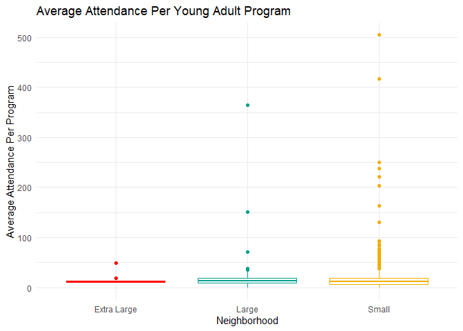<!-- -->

``` r
ggplot(ProgramAttendancePerProgram %>% filter(AgeGroup == "Young Adults")) +
  geom_boxplot(aes(x = Neighborhood, y = Attendance, color = Neighborhood)) +
  scale_color_manual(values = threeColors) +
  labs(title = "Average Attendance Per Young Adult Program (Zoomed Into the Median)",
       x = "Age Group",
       y = "Average Attendance Per Program") +
  theme_minimal() +
  guides(color = "none") +
  coord_cartesian(ylim=c(0,50))
```

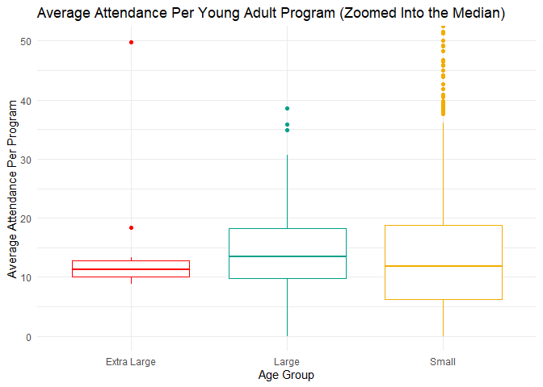<!-- -->

``` r
ggplot(ProgramAttendancePerProgram %>% filter(AgeGroup == "Children")) +
  geom_boxplot(aes(x = Neighborhood, y = Attendance, color = Neighborhood)) +
  scale_color_manual(values = threeColors) +
  labs(title = "Average Attendance Per Childrens Program",
       x = "Neighborhood",
       y = "Average Attendance Per Program") +
  theme_minimal() +
  guides(color = "none")
```

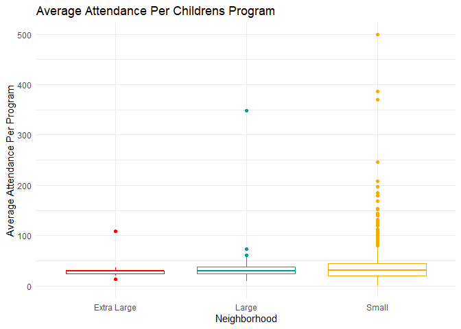<!-- -->

``` r
ggplot(ProgramAttendancePerProgram %>% filter(AgeGroup == "Children")) +
  geom_boxplot(aes(x = Neighborhood, y = Attendance, color = Neighborhood)) +
  scale_color_manual(values = threeColors) +
  labs(title = "Average Attendance Per Childrens Program (Zoomed Into the Median)",
       x = "Age Group",
       y = "Average Attendance Per Program") +
  theme_minimal() +
  guides(color = "none") +
  coord_cartesian(ylim=c(0,50))
```

<!-- -->

``` r
ggplot(ProgramAttendancePerProgram %>% filter(Neighborhood == "Extra Large")) +
  geom_boxplot(aes(x = AgeGroup, y = Attendance, color = AgeGroup)) +
  scale_color_manual(values = threeColors) +
  labs(title = "Average Attendance in Extra Large Libraries Per Program",
       x = "Neighborhood",
       y = "Average Attendance Per Program") +
  theme_minimal() +
  guides(color = "none")
```

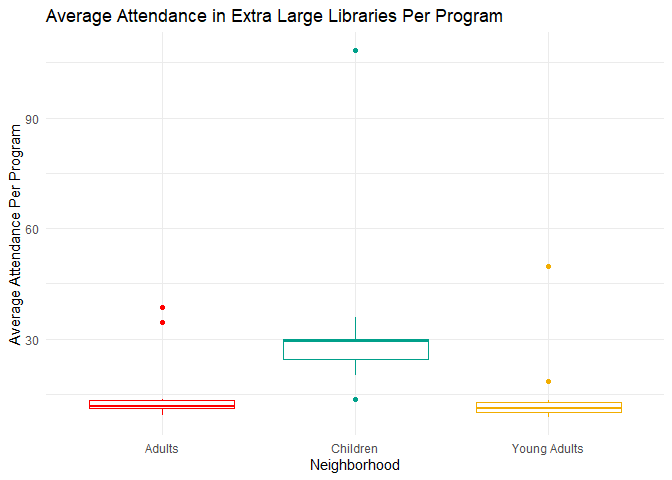<!-- -->

``` r
ggplot(ProgramAttendancePerProgram %>% filter(AgeGroup == "Children")) +
  geom_boxplot(aes(x = Neighborhood, y = Attendance, color = Neighborhood)) +
  scale_color_manual(values = threeColors) +
  labs(title = "Average Attendance in Extra Large Libraries Per Program (Zoomed Into the Median)",
       x = "Age Group",
       y = "Average Attendance Per Program") +
  theme_minimal() +
  guides(color = "none") +
  coord_cartesian(ylim=c(0,50))
```

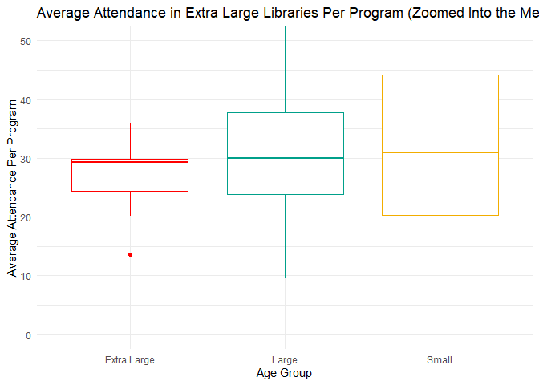<!-- -->

### Remove highly correlated features and save data

``` r
y = dfnoOutliers$LibraryVisits

dfNoOutliersNoVisits = dfnoOutliers %>%
  select(-LibraryVisits)

(highCorr = caret::findCorrelation(cor(dfNoOutliersNoVisits[-c(1:2)]), .7, verbose=TRUE, names = TRUE))
```

    ## Compare row 28  and column  30 with corr  0.991 
    ##   Means:  0.516 vs 0.309 so flagging column 28 
    ## Compare row 30  and column  10 with corr  0.909 
    ##   Means:  0.504 vs 0.303 so flagging column 30 
    ## Compare row 10  and column  27 with corr  0.894 
    ##   Means:  0.495 vs 0.296 so flagging column 10 
    ## Compare row 27  and column  13 with corr  0.848 
    ##   Means:  0.481 vs 0.289 so flagging column 27 
    ## Compare row 13  and column  22 with corr  0.886 
    ##   Means:  0.471 vs 0.283 so flagging column 13 
    ## Compare row 22  and column  21 with corr  0.883 
    ##   Means:  0.464 vs 0.276 so flagging column 22 
    ## Compare row 21  and column  12 with corr  0.867 
    ##   Means:  0.453 vs 0.27 so flagging column 21 
    ## Compare row 12  and column  23 with corr  0.893 
    ##   Means:  0.446 vs 0.263 so flagging column 12 
    ## Compare row 23  and column  14 with corr  0.801 
    ##   Means:  0.435 vs 0.257 so flagging column 23 
    ## Compare row 14  and column  40 with corr  0.716 
    ##   Means:  0.419 vs 0.25 so flagging column 14 
    ## Compare row 40  and column  9 with corr  0.764 
    ##   Means:  0.422 vs 0.244 so flagging column 40 
    ## Compare row 9  and column  29 with corr  0.707 
    ##   Means:  0.403 vs 0.237 so flagging column 9 
    ## Compare row 35  and column  29 with corr  0.731 
    ##   Means:  0.385 vs 0.231 so flagging column 35 
    ## Compare row 29  and column  25 with corr  0.718 
    ##   Means:  0.362 vs 0.225 so flagging column 29 
    ## Compare row 36  and column  33 with corr  0.825 
    ##   Means:  0.374 vs 0.219 so flagging column 36 
    ## Compare row 24  and column  11 with corr  0.704 
    ##   Means:  0.355 vs 0.212 so flagging column 24 
    ## Compare row 33  and column  11 with corr  0.824 
    ##   Means:  0.348 vs 0.206 so flagging column 33 
    ## Compare row 11  and column  8 with corr  0.743 
    ##   Means:  0.317 vs 0.2 so flagging column 11 
    ## Compare row 8  and column  57 with corr  0.754 
    ##   Means:  0.316 vs 0.195 so flagging column 8 
    ## Compare row 57  and column  4 with corr  0.712 
    ##   Means:  0.291 vs 0.19 so flagging column 57 
    ## Compare row 52  and column  48 with corr  0.839 
    ##   Means:  0.322 vs 0.185 so flagging column 52 
    ## Compare row 4  and column  7 with corr  0.717 
    ##   Means:  0.262 vs 0.179 so flagging column 4 
    ## Compare row 48  and column  51 with corr  0.837 
    ##   Means:  0.283 vs 0.174 so flagging column 48 
    ## Compare row 51  and column  59 with corr  0.834 
    ##   Means:  0.26 vs 0.169 so flagging column 51 
    ## Compare row 2  and column  3 with corr  0.771 
    ##   Means:  0.218 vs 0.167 so flagging column 2 
    ## Compare row 37  and column  18 with corr  0.715 
    ##   Means:  0.262 vs 0.165 so flagging column 37 
    ## Compare row 7  and column  5 with corr  0.72 
    ##   Means:  0.223 vs 0.159 so flagging column 7 
    ## Compare row 53  and column  54 with corr  0.778 
    ##   Means:  0.222 vs 0.153 so flagging column 53 
    ## Compare row 38  and column  42 with corr  0.884 
    ##   Means:  0.239 vs 0.149 so flagging column 38 
    ## Compare row 42  and column  41 with corr  0.739 
    ##   Means:  0.195 vs 0.145 so flagging column 42 
    ## Compare row 45  and column  46 with corr  0.923 
    ##   Means:  0.186 vs 0.141 so flagging column 45 
    ## Compare row 49  and column  50 with corr  0.797 
    ##   Means:  0.153 vs 0.139 so flagging column 49 
    ## Compare row 19  and column  17 with corr  0.783 
    ##   Means:  0.108 vs 0.141 so flagging column 17 
    ## Compare row 60  and column  63 with corr  0.737 
    ##   Means:  0.087 vs 0.146 so flagging column 63 
    ## All correlations <= 0.7

    ##  [1] "SalaryWagesExpenditures"             "TotalStaffExpenditures"             
    ##  [3] "NumofLibrarianFTEs"                  "TotalPrintMaterialsExpenditures"    
    ##  [5] "TotalOperatingIncome"                "TotalCollectionExpenditures"        
    ##  [7] "TotalOperatingExpenditures"          "NumofALAMLSLibrarianFTEs"           
    ##  [9] "PrintMaterialsExpenditures"          "LocalGovernmentIncome"              
    ## [11] "TotalPrintMaterialsHeld"             "Totalpersonsemployed"               
    ## [13] "NumofPhysicalAudioMaterials"         "EmployeeBenefitsExpenditures"       
    ## [15] "NumofPhysicalVideoMaterials"         "PrintSerialSubscriptionExpenditures"
    ## [17] "BooksChildrenHeld"                   "FTEAllotherpaidstaff"               
    ## [19] "HoursOpenAllOutlets"                 "NumofInternetTerminals"             
    ## [21] "TotalProgramAttendance"              "NumofCentralLibraries"              
    ## [23] "NumofPrograms"                       "ChildrensProgramAttendance"         
    ## [25] "RegisteredUsersasofJune30"           "NumofCurrentSerialSubscriptions"    
    ## [27] "NumofOutlets"                        "NumofAdultPrograms"                 
    ## [29] "NumofElectronicBooks"                "NumofDownloadableVideoMaterials"    
    ## [31] "ILLloanstoothers"                    "NumofYoungAdultPrograms"            
    ## [33] "ChildrenProgramAttendancePerProgram" "CapitalOutlayIncomefromLocalSources"

``` r
dfDropCorr = dfNoOutliersNoVisits %>%
  select(-highCorr)
```

    ## Warning: Using an external vector in selections was deprecated in tidyselect 1.1.0.
    ## ℹ Please use `all_of()` or `any_of()` instead.
    ##   # Was:
    ##   data %>% select(highCorr)
    ## 
    ##   # Now:
    ##   data %>% select(all_of(highCorr))
    ## 
    ## See <https://tidyselect.r-lib.org/reference/faq-external-vector.html>.
    ## This warning is displayed once every 8 hours.
    ## Call `lifecycle::last_lifecycle_warnings()` to see where this warning was
    ## generated.

``` r
X = dfDropCorr

corrplot::corrplot(cor(X[-c(1:2)]),tl.cex=.5)
```

<!-- -->

``` r
dfLibraryVisitsSupervisor = cbind(X,y)
```
