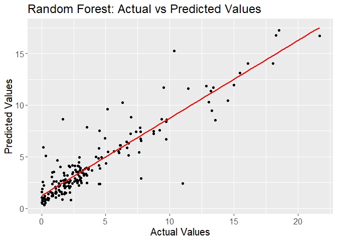
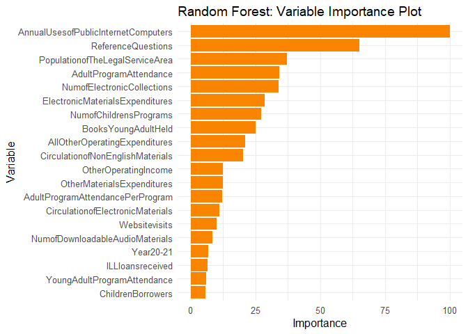
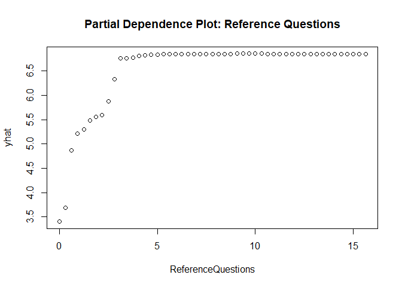
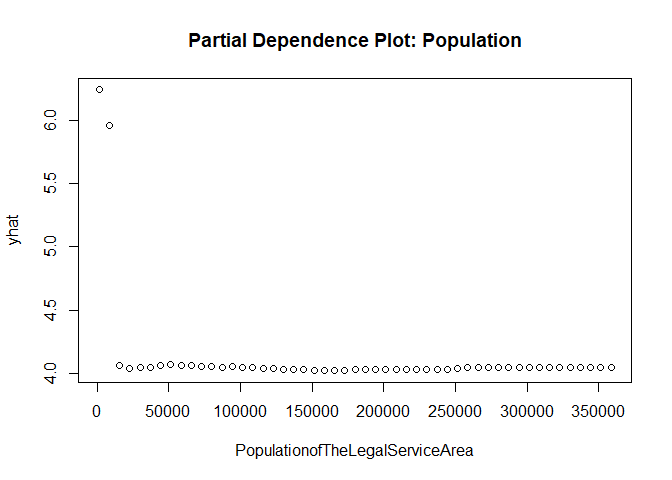

Random Forests Model
================
Kathy Trieu

Fall 2023

### R Setup

``` r
rm(list = ls()); gc()
```

    ##          used (Mb) gc trigger (Mb) max used (Mb)
    ## Ncells 458305 24.5     987320 52.8   644245 34.5
    ## Vcells 818912  6.3    8388608 64.0  1635327 12.5

``` r
pacman::p_load(tidyverse,doParallel,caret,randomForest,wesanderson,pdp)
```

### Load Data

``` r
df = read.csv('data/CPL_Ready_For_Model.csv')

locationID = df$Location
year       = df$Year

df = df %>%
  select(-X, -Location, -Year) %>%
  sapply(., as.numeric) %>% as.data.frame(.) %>%
  mutate(Year = year) %>%
  select(Year, everything())
```

### Fit Model

``` r
set.seed(123) 

num_cores = detectCores()-2
cl        = makeCluster(num_cores)
registerDoParallel(cl)

indices   = createDataPartition(df$y, p = 0.8, list = FALSE)
trainData = df[indices, ]
testData  = df[-indices, ]

ctrl  = trainControl(method = "cv", number = 5, verboseIter = TRUE) 
# rfOut = train(y ~ ., data = trainData, method = "ranger", trControl = ctrl,
#               tuneLength=30, num.trees=1000, importance="permutation")

#saveRDS - Model was saved
stopCluster(cl)

rfModel = readRDS(file="Output/rfModel.rda")
predictions = predict(rfModel, newdata = testData)
```

### Model Results

``` r
threeColors = wes_palette("Darjeeling1", 3, type = "discrete")
oneColor    = wes_palette("Darjeeling1", 1, type = "discrete")
allColors   = wes_palette("Darjeeling1", 5, type = "discrete")

mse_test      = mean((predictions - testData$y)^2)
rmse_test     = sqrt(mse_test)
mae_test      = mean(abs(predictions - testData$y))
rsquared_test = 1 - mse_test / var(testData$y)
```

    ## Test Set Metrics:

    ## Mean Squared Error (MSE):  3.22082679213214

    ## Root Mean Squared Error (RMSE):  1.794666206327

    ## Mean Absolute Error (MAE):  1.17957373649179

    ## R-squared:  0.818107187180717

``` r
rfPredictions = data.frame(Actual = testData$y, Predicted = predictions)

ggplot(rfPredictions, aes(x = Actual, y = Predicted)) +
  geom_point() +
  geom_smooth(method = "lm", se = FALSE, color = oneColor) +
  ggtitle("Random Forest: Actual vs Predicted Values") +
  xlab("Actual Values") +
  ylab("Predicted Values")+
  theme(text = element_text(size=15))
```

    ## `geom_smooth()` using formula = 'y ~ x'

<!-- -->

### Variable Importance

``` r
importance       = varImp(rfModel)$importance %>% arrange(desc(Overall)) %>% head(20)
varNames         = rownames(importance)
importanceScores = importance[, 1]

ggplot(data = data.frame(Variable = varNames, Importance = importanceScores),
       aes(x = Importance, y = fct_reorder(Variable, Importance))) +
  geom_bar(stat = "identity", fill = "#F98400") +
  labs(title = "Random Forest: Variable Importance Plot",
       x = "Importance", y = "Variable") +
  theme_minimal() +
  theme(text = element_text(size=12))
```

<!-- -->

### Partial Plots

``` r
partialPlot = partial(rfModel, pred.var = "ReferenceQuestions")
plot(partialPlot, main = "Partial Dependence Plot: Reference Questions")
```

<!-- -->

``` r
partialPlot = partial(rfModel, pred.var = "AnnualUsesofPublicInternetComputers")
plot(partialPlot, main = "Partial Dependence Plot:Annual Uses of Public Internet Computers")
```

<!-- -->

``` r
partialPlot = partial(rfModel, pred.var = "PopulationofTheLegalServiceArea")
plot(partialPlot, main = "Partial Dependence Plot: Population")
```

<!-- -->

``` r
partialPlot = partial(rfModel, pred.var = "AdultProgramAttendance")
plot(partialPlot, main = "Partial Dependence Plot: Adult Program Attendance")
```

<!-- -->

### Residual Plots

``` r
rfPredictions['residuals'] = (testData$y - predictions) / sd(predictions)

ggplot(rfPredictions) +
  geom_histogram(aes(x=residuals),fill="#5BBCD6") +
  labs(title = "Residuals",
       x = "Residuals") +
  theme_minimal()
```

<!-- -->

``` r
ggplot(rfPredictions) +
  geom_point(aes(x=predictions, y=residuals),color="#5BBCD6") +
  labs(title = "Standardized Residuals vs. Predictions",
       x = "Predictions", y= "Standardized Residuals") +
  theme_minimal()
```

<!-- -->
