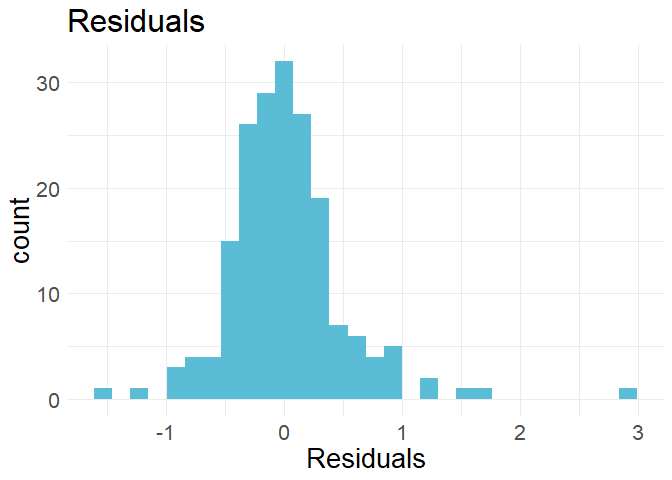
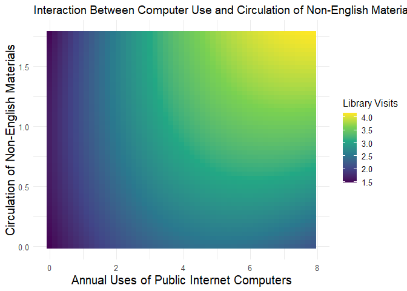

Support Vector Machine Regression
================
Kathy Trieu

Fall 2023

### R Setup

``` r
rm(list = ls()); gc()
```

    ##          used (Mb) gc trigger (Mb) max used (Mb)
    ## Ncells 458359 24.5     987474 52.8   644245 34.5
    ## Vcells 819480  6.3    8388608 64.0  1635329 12.5

``` r
pacman::p_load(tidyverse,doParallel,caret,randomForest,wesanderson,pdp,glmnet)
```

### Load Data

``` r
df = read.csv('data/CPL_Ready_For_Model.csv')

locationID    = df$Location
year          = df$Year
CIPACompliant = df$CIPACompliant

df = df %>%
  select(-X, -Location, -Year) %>%
  sapply(., as.numeric) %>% as.data.frame(.) %>%
  mutate(Year = as.factor(year),
         CIPACompliant = as.factor(CIPACompliant)) %>%
  select(Year, everything())
```

### Split Data

``` r
features   = df[, -which(names(df) == "y")]
supervisor = df[["y"]] %>% sqrt(.)

scaled_df = features %>%
  select(-Year, -CIPACompliant) %>%
  scale(.) %>%
  as.data.frame(.) %>%
  mutate(Year = as.factor(year),
         CIPACompliant = as.factor(CIPACompliant)) %>%
  select(Year, everything())

set.seed(123)
train_indices = createDataPartition(supervisor, p = 0.8, list = FALSE)
Xtrain        = features[train_indices, ]
Xtest         = features[-train_indices, ]
Ytrain        = supervisor[train_indices]
Ytest         = supervisor[-train_indices]
```

### Fit Model

``` r
library(doParallel)

num_cores = detectCores()-2
cl        = makeCluster(num_cores)
registerDoParallel(cl)

df       = cbind(Xtrain,Ytrain)
tuneGrid = expand.grid(C = c(0.1, 1, 10, 100),scale = c(0.1, 1, 10),degree = c(2,3)) 
ctrl     = trainControl(method = "cv", number = 5, allowParallel = TRUE)
# svmOut   = train(Ytrain ~ .,data = df,method = "svmPoly", trControl = ctrl,tuneGrid = tuneGrid)
# Model was saved.
svmOut = readRDS("Output/svmModel.rda")

stopCluster(cl)
```

### Model Results

``` r
predictions   = predict(svmOut, newdata = Xtest)
actual_values = Ytest

mse  = mean((predictions - actual_values)^2)
rmse = sqrt(mse)
mae  = mean(abs(predictions - actual_values))

ss_residual = sum((actual_values - predictions)^2)
ss_total    = sum((actual_values - mean(actual_values))^2)
r_squared   = 1 - (ss_residual / ss_total)
```

    ## Mean Squared Error (MSE): 0.1971364

    ## Root Mean Squared Error (RMSE): 0.4440005

    ## Mean Absolute Error (MAE): 0.3045171

    ## R-squared (R²): 0.7861317

### Variable Importance

``` r
PolyVarImp = varImp(svmOut)

importance       = PolyVarImp$importance %>% arrange(desc(Overall)) %>% head(20)
varNames         = rownames(importance)
importanceScores = importance[, 1]

ggplot(data = data.frame(Variable = varNames, Importance = importanceScores),
       aes(x = Importance, y = fct_reorder(Variable, Importance))) +
  geom_bar(stat = "identity", fill = "#F98400") +
  labs(title = "SVM: Variable Importance Plot",
       x = "Importance", y = "Variable") +
  theme_minimal()+
  theme(text = element_text(size=12))
```

<!-- -->

### Residual Plots

``` r
polyPredictions = data.frame(Actual = actual_values, 
                             Predicted = predictions,
                             residuals=(actual_values - predictions) / sd(predictions))

ggplot(polyPredictions) +
  geom_histogram(aes(x=residuals),fill="#5BBCD6") +
  labs(title = "Residuals",
       x = "Residuals") +
  theme_minimal()+
  theme(text = element_text(size=20))
```

<!-- -->

``` r
ggplot(polyPredictions) +
  geom_point(aes(x=predictions, y=residuals),color="#5BBCD6") +
  labs(title = "Standardized Residuals vs. Predictions",
       x = "Predictions", y= "Standardized Residuals") +
  theme_minimal()+
  theme(text = element_text(size=20))
```

<!-- -->

``` r
threeColors = wes_palette("Darjeeling1", 3, type = "discrete")
oneColor    = wes_palette("Darjeeling1", 1, type = "discrete")
allColors   = wes_palette("Darjeeling1", 5, type = "continuous")

ggplot(polyPredictions, aes(x = Actual, y = Predicted)) +
  geom_point() +
  geom_smooth(method = "lm", se = FALSE, color = oneColor) +
  ggtitle("SVMR: Actual vs Predicted Values") +
  xlab("Actual Values") +
  ylab("Predicted Values")+
  theme(text = element_text(size=15))
```

<!-- -->

# Partial Plots

``` r
CompNonEng = partial(svmOut, 
        pred.var = c("AnnualUsesofPublicInternetComputers", "CirculationofNonEnglishMaterials"),
        pred.func=predict, 
        plot=FALSE)

ChilProNonEng  = partial(svmOut, 
        pred.var = c("NumofChildrensPrograms", "CirculationofNonEnglishMaterials"),
        pred.func=predict, 
        plot=FALSE)

ChilAdult  = partial(svmOut, 
        pred.var = c("NumofChildrensPrograms", "AdultProgramAttendance"),
        pred.func=predict, 
        plot=FALSE)

CompAdult   = partial(svmOut, 
        pred.var = c("AnnualUsesofPublicInternetComputers", "AdultProgramAttendance"),
        pred.func=predict, 
        plot=FALSE)

autoplot(CompAdult,contour=FALSE,legend.title="Library Visits", pdp.color=allColors) +
  labs(title="Interaction Between Computer Use and Adult Program Attendance",       
       x="Annual Uses of Public Internet Computers",
       y="Adult Program Attendance") +
  theme_minimal() +
  theme(text = element_text(size=12),
        axis.title = element_text(size=15))
```

<!-- -->

``` r
autoplot(CompNonEng,contour=FALSE,legend.title="Library Visits", pdp.color=allColors) +
  labs(title="Interaction Between Computer Use and Circulation of Non-English Materials",       
       x="Annual Uses of Public Internet Computers",
       y="Circulation of Non-English Materials") +
  theme_minimal()  +
  theme(text = element_text(size=12),
        axis.title = element_text(size=15))
```

<!-- -->

``` r
autoplot(ChilAdult,contour=FALSE,legend.title="Library Visits", pdp.color=allColors) +
  labs(title="Number of Childrens Programs and Adult Program Attendance",       
       x="Number of Children's Programs",
       y="Adult Program Attendance") +
  theme_minimal()  +
  theme(text = element_text(size=12),
        axis.title = element_text(size=15))
```

<!-- -->

``` r
autoplot(ChilProNonEng,contour=FALSE,legend.title="Library Visits", pdp.color=allColors) +
  labs(title="Number of Childrens Programs and Circulation of Non-English Materials",       
       x="Number of Children's Programs",
       y="Circulation of Non-English Materials") +
  theme_minimal()  +
  theme(text = element_text(size=12),
        axis.title = element_text(size=15))
```

<!-- -->
