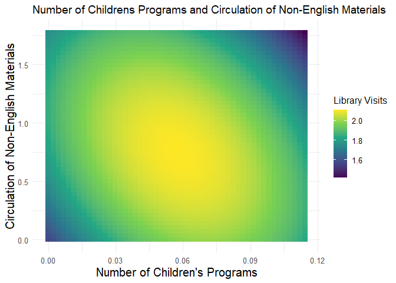

## Step 1: Combine Data Files


### R Setup

``` r
rm(list = ls())

pacman::p_load(tidyverse,doParallel,caret,randomForest,wesanderson,pdp,glmnet)
```

### Combine Data Files

Initially, I merged the individual CSV files and saved them as a unified dataframe.

``` r
paths        = dir("data/raw/",pattern="All-",full.names=TRUE)
names(paths) = basename(paths)
```

``` r
dfList = lapply(paths,read.csv)
df     = do.call(plyr::rbind.fill,dfList)
```

All features utilize "X." to denote the number, so I replaced all instances of "X." with "Num" for clarity.


``` r
names(df) = names(df) %>% 
  str_replace_all(c("X."="Num",
                    "[.]"=""))
```

### Combine Features

#### that are the same but named differently

The primary challenge I encountered was that while the library collected data of the same type according to their definition, they did not maintain consistent naming conventions. For instance, all references were to the total number of electronic books in the collection, yet the feature names varied, such as "NumofElectronicBooks," "NumofElectronicBooksinCollection," and "TotalElectronicBooks."

To address this inconsistency, I consolidated the columns using "unite."

``` r
df = df %>%
  unite("NumofElectronicBooks",c("NumofElectronicBooks","NumofElectronicBooksinCollection","TotalElectronicBooks")
        ,na.rm=TRUE,sep="/",remove=TRUE) %>%
  unite("NumofElectronicCollections", c("NumofElectronicCollections","NumofElectronicCollectionsinCollection")
        ,na.rm=TRUE,sep="/",remove=TRUE) %>%
  unite("NumofChildrensPrograms", c("NumofChildrensPrograms","NumofChildrensProgramscalculated","ofChildrensProgramscalculated")
        ,na.rm=TRUE,sep="/",remove=TRUE) %>%
  unite("TotalProgramAttendance", c("TotalProgramAttendance", "ProgramAttendance")
        ,na.rm=TRUE,sep="/",remove=TRUE) %>%
  unite("NumofOutlets", c("NumofOutlets","TotalofOutlets")
        ,na.rm=TRUE,sep="/",remove=TRUE)

df = df %>%
  unite("NumofPhysicalAudioMaterials", c("NumofPhysicalAudioMaterials","NumofPhysicalAudioMaterialsinCollection")
        ,na.rm=TRUE,sep="/",remove=TRUE) %>%
  unite("NumofPhysicalVideoMaterials", c("NumofPhysicalVideoMaterials","NumofPhysicalVideoMaterialsinCollection")
        ,na.rm=TRUE,sep="/",remove=TRUE) %>%
  unite("NumofDownloadableAudioMaterials", c("NumofDownloadableAudioMaterials","NumofDownloadableAudioMaterialsinCollection")
        ,na.rm=TRUE,sep="/",remove=TRUE) %>%
    unite("NumofDownloadableVideoMaterials", c("NumofDownloadableVideoMaterials","NumofDownloadableVideoMaterialsinCollection")
          ,na.rm=TRUE,sep="/",remove=TRUE) %>%
  unite("Doyouchargelatefines", c("Doyouchargelatefines","Doyouchargeanypatronslatefinesforphysicalmaterials")
        ,na.rm=TRUE,sep="/",remove=TRUE)

naCountAfter = sort(colSums(is.na(df))) %>% as.data.frame(.)

write.csv(df, file = "data/CPL_Combined_Data.csv", row.names = FALSE)
```
After completing this process, regrettably, certain inconsistencies persisted. Drafting rules for each one appeared to be an impractical endeavor, prompting my decision to address these discrepancies manually in Microsoft Excel. This approach was chosen to safeguard against any potential data loss and streamline the process. Consequently, the dataframe utilized in the subsequent step, feature selection, is the version that underwent manual cleaning in Microsoft Excel.

## Step 2: Data Pre-Processing

### Missing Values Management

#### Removed all features with 80% or more missing values

``` r
naCount = sort(colSums(is.na(df))) %>% as.data.frame(.)

missingSupervisor = df %>%
  filter(., is.na(LibraryVisits))

df = df %>%
  mutate(naProp = (apply ( X = is.na(df), MARGIN = 1, FUN = mean ) )) %>%
  filter(naProp < .2) %>%
  select(-naProp) %>%
  filter(!is.na(LibraryVisits)) 
```

#### Corrected Column Data Types

``` r
dfFixedTypes = df %>% 
  mutate(across((starts_with("Numof") | 
                   starts_with("Total") |
                   contains("Attendance") |
                   contains("Loans") |
                   contains("Books") |
                   contains("Hours") |
                   contains("Visits") |
                   contains("Reference") |
                   contains("Circulation") | 
                   contains("Population") |
                   contains("Users") |
                   contains("Uses") |
                   contains("Children") |
                   contains("Expenditures") |
                   contains("Income")
                   ), ~gsub("\\,", "", .))) %>%
  mutate(across((contains("Expenditures") | contains("Income")), ~gsub("\\$", "", .))) %>%
  mutate(CIPACompliant = ifelse(CIPACompliant == "No",0,1)) %>%
  apply(.,2, function(x) str_replace_all(string=x, pattern=" ", repl="")) %>% as.data.frame(.)

locationID = dfFixedTypes$Location
year       = dfFixedTypes$FiscalYear

dfQuant = dfFixedTypes %>%
  select(., -FSCSID) %>%
  select(., PopulationofTheLegalServiceArea:NumofChildrensPrograms) %>%
  sapply(., as.numeric) %>% as.data.frame(.) %>%
  mutate(Location = locationID,
         Year = year) %>%
  select(Location, Year, everything())
```

    ## Warning in lapply(X = X, FUN = FUN, ...): NAs introduced by coercion

    ## Warning in lapply(X = X, FUN = FUN, ...): NAs introduced by coercion

    ## Warning in lapply(X = X, FUN = FUN, ...): NAs introduced by coercion

    ## Warning in lapply(X = X, FUN = FUN, ...): NAs introduced by coercion

#### Median Imputed Missing Data in Quantitative Features

``` r
dfQuant[dfQuant == "-1"] <- NA
dfQuant[dfQuant == "-2"] <- NA

dfQuantImputed = dfQuant %>%
  caret::preProcess(method="medianImpute") %>%
  predict(newdata = dfQuant)
```

#### Checked for Features Without Meaningful Variance

``` r
caret::nearZeroVar(dfQuantImputed, saveMetrics=TRUE)
```

    ##                                        freqRatio percentUnique zeroVar   nzv
    ## Location                                1.000000    17.0309654   FALSE FALSE
    ## Year                                    1.000000     0.5464481   FALSE FALSE
    ## PopulationofTheLegalServiceArea         1.500000    99.3624772   FALSE FALSE
    ## RegisteredUsersasofJune30               2.000000    99.3624772   FALSE FALSE
    ## ChildrenBorrowers                       9.000000    95.7194900   FALSE FALSE
    ## NumofCentralLibraries                   8.150000     0.1821494   FALSE FALSE
    ## NumofBranchLibraries                    2.966667     3.0054645   FALSE FALSE
    ## NumofBookmobiles                        5.147929     0.4553734   FALSE FALSE
    ## NumofOutlets                            2.202312     3.6429872   FALSE FALSE
    ## LibraryVisits                           6.444444    93.7158470   FALSE FALSE
    ## HoursOpenAllOutlets                     3.333333    68.8524590   FALSE FALSE
    ## Totalpersonsemployed                    1.000000    25.0455373   FALSE FALSE
    ## NumofLibrarianFTEs                      2.293103    28.2331512   FALSE FALSE
    ## FTEAllotherpaidstaff                    1.173913    52.8233151   FALSE FALSE
    ## NumofALAMLSLibrarianFTEs                2.169231    26.3205829   FALSE FALSE
    ## TotalOperatingIncome                    2.000000    99.6357013   FALSE FALSE
    ## LocalGovernmentIncome                   2.000000    99.3624772   FALSE FALSE
    ## StateIncome                            30.500000    71.1293260   FALSE FALSE
    ## FederalIncome                          49.230769    35.8834244   FALSE FALSE
    ## CapitalOutlayIncomefromLocalSources   110.285714    26.6848816   FALSE FALSE
    ## CapitalOutlayIncomefromStateSources   526.000000     4.0072860   FALSE  TRUE
    ## CapitalOutlayIncomefromFederalSources 532.500000     2.7322404   FALSE  TRUE
    ## CapitalOutlayIncomefromOtherSources   193.400000    11.2021858   FALSE FALSE
    ## TotalCapitalOutlayIncome              137.200000    35.5191257   FALSE FALSE
    ## OtherOperatingIncome                   27.000000    81.8761384   FALSE FALSE
    ## TotalOperatingExpenditures              2.000000    99.9089253   FALSE FALSE
    ## TotalCollectionExpenditures             1.500000    99.3624772   FALSE FALSE
    ## PrintMaterialsExpenditures              1.250000    96.6302368   FALSE FALSE
    ## PrintSerialSubscriptionExpenditures     8.500000    84.6994536   FALSE FALSE
    ## ElectronicMaterialsExpenditures         7.800000    92.2586521   FALSE FALSE
    ## OtherMaterialsExpenditures             25.000000    79.2349727   FALSE FALSE
    ## TotalPrintMaterialsExpenditures         1.250000    97.6320583   FALSE FALSE
    ## SalaryWagesExpenditures                11.500000    97.8142077   FALSE FALSE
    ## EmployeeBenefitsExpenditures            4.666667    96.8123862   FALSE FALSE
    ## TotalStaffExpenditures                 11.500000    97.6320583   FALSE FALSE
    ## TotalCapitalExpenditures              305.500000    44.2622951   FALSE FALSE
    ## AllOtherOperatingExpenditures           2.500000    98.6338798   FALSE FALSE
    ## BooksChildrenHeld                       2.000000    99.1803279   FALSE FALSE
    ## BooksYoungAdultHeld                     2.000000    95.8105647   FALSE FALSE
    ## NumofPhysicalAudioMaterials             1.333333    96.8123862   FALSE FALSE
    ## NumofPhysicalVideoMaterials             2.000000    97.8142077   FALSE FALSE
    ## NumofCurrentSerialSubscriptions         1.590909    42.3497268   FALSE FALSE
    ## NumofElectronicBooks                    6.571429    92.0765027   FALSE FALSE
    ## NumofElectronicCollections              1.114286     9.5628415   FALSE FALSE
    ## TotalPrintMaterialsHeld                 2.000000    99.4535519   FALSE FALSE
    ## NumofDownloadableAudioMaterials         4.818182    88.5245902   FALSE FALSE
    ## NumofDownloadableVideoMaterials        23.666667    54.2805100   FALSE FALSE
    ## CirculationofNonEnglishMaterials        3.818182    92.6229508   FALSE FALSE
    ## CirculationofElectronicMaterials        1.000000    93.2604736   FALSE FALSE
    ## ILLloanstoothers                       18.692308    65.0273224   FALSE FALSE
    ## ILLloansreceived                       15.250000    62.7504554   FALSE FALSE
    ## ReferenceQuestions                     41.333333    87.8870674   FALSE FALSE
    ## NumofPrograms                           1.500000    77.5956284   FALSE FALSE
    ## NumofYoungAdultPrograms                 4.142857    30.9653916   FALSE FALSE
    ## YoungAdultProgramAttendance             8.571429    71.3114754   FALSE FALSE
    ## ChildrensProgramAttendance              1.200000    96.3570128   FALSE FALSE
    ## TotalProgramAttendance                  1.833333    97.0856102   FALSE FALSE
    ## NumofAdultPrograms                      2.583333    48.4517304   FALSE FALSE
    ## AdultProgramAttendance                  3.400000    89.2531876   FALSE FALSE
    ## CIPACompliant                           1.351178     0.1821494   FALSE FALSE
    ## AnnualUsesofPublicInternetComputers     2.941176    92.8051002   FALSE FALSE
    ## NumofInternetTerminals                  1.040000    21.4936248   FALSE FALSE
    ## Websitevisits                          58.000000    78.5063752   FALSE FALSE
    ## NumofChildrensPrograms                  1.375000    65.3005464   FALSE FALSE

``` r
dfQuantImputed = dfQuantImputed %>% 
  select(-CapitalOutlayIncomefromStateSources,
         -CapitalOutlayIncomefromFederalSources)

write.csv(dfQuantImputed, file = "data/CPL_Combined_Data.csv", row.names = FALSE)
```

## Step 3: Feature Selection

``` r
df = read.csv('data/CPL_Cleaned_Data.csv')

locationID = df$Location
year       = df$Year

df = df %>%
  select(-X, -Location, -Year) %>%
  sapply(., as.numeric) %>% as.data.frame(.) %>%
  mutate(Location = locationID,
         Year     = year) %>%
  select(Location, Year, everything())

dataUnreliable = c("SANJUANBAUTISTACITYLIBRARY","ALPINECOUNTYLIBRARY/ARCHIVES",
                   "VERNONPUBLICLIBRARY","TEHAMACOUNTYLIBRARY")
```

### Remove Unreliable Data

#### I manually checked for values that did not make sense and removed rows that included primarily unreliable data.

``` r
df = df %>%
  filter(!(Location %in% dataUnreliable)) %>%
  filter(!(Location == "SOUTHSANFRANCISCOPUBLICLIBRARY" & Year == "20-21")) %>%
  filter(!(Location == "COLTONPUBLICLIBRARY" & Year == "19-20"))
```

### Standardize Features

``` r
df = df %>%
  mutate(TotalProgramAttendancePerProgram      = TotalProgramAttendance/NumofPrograms,
         AdultProgramAttendancePerProgram      = AdultProgramAttendance/NumofAdultPrograms,
         YoungAdultProgramAttendancePerProgram = YoungAdultProgramAttendance/NumofYoungAdultPrograms,
         ChildrenProgramAttendancePerProgram   = ChildrensProgramAttendance/NumofChildrensPrograms,
         .keep ="all") 

df[is.na(df)]  = 0
leaveAloneVars = c("Location","Year","CIPACompliant",
                   "PopulationofTheLegalServiceArea",
                   "TotalProgramAttendancePerProgram",
                   "AdultProgramAttendancePerProgram",
                  "YoungAdultProgramAttendancePerProgram",
                   "ChildrenProgramAttendancePerProgram")
LibraryVisits = df$LibraryVisits

# Set Aside Dataframes for EDA later.
dfNotRates = df
dfRatesExceptLibraryVisits = df %>%
  select(-LibraryVisits) %>%
  mutate(across(-all_of(leaveAloneVars),.fns=~./PopulationofTheLegalServiceArea)) %>%
  mutate(LibraryVisits = LibraryVisits)

df = df %>%
  mutate(across(-all_of(leaveAloneVars),.fns=~./PopulationofTheLegalServiceArea))
```

### Check Skewness

``` r
skewnessVec = df %>%
  select(-Location, -Year) %>%
  sapply(., e1071::skewness, na.rm=TRUE)
```

### Perform Cluster Analysis

``` r
threeColors = wes_palette("Darjeeling1", 3, type = "discrete")
oneColor    = wes_palette("Darjeeling1", 1, type = "discrete")

n_clusters = 10
wss        = numeric(n_clusters)

for (i in 1:n_clusters) {
  km.out <- kmeans(df[,-c(1,2)], centers = i, nstart = 20)
  wss[i] <- km.out$tot.withinss
}

wss_df     = tibble(clusters = 1:n_clusters, wss = wss)
scree_plot = ggplot(wss_df, aes(x = clusters, y = wss, group = 1)) +
                geom_point(size = 4)+
                geom_line() +
                scale_x_continuous(breaks = c(2, 4, 6, 8, 10)) +
                xlab('Number of clusters')
scree_plot
```

<!-- -->

``` r
k      = 2
km.out = kmeans(df[,-c(1,2)], centers = k, nstart = 20)

factoextra::fviz_cluster(km.out, data = df[,-c(1,2)],
             geom = "text",
             ggtheme = theme_bw(),
             ellipse.type = "convex") +
           theme_minimal() +
           scale_fill_manual(values = wes_palette("Darjeeling1", 2, type = "discrete")) +
           scale_color_manual(values = wes_palette("Darjeeling1", 2, type = "discrete"))
```

<!-- -->

### Used Cluster Analysis Information to Split Data Meaningfully

#### Cluster analysis revealed two distinct clusters: one large cluster of small to large libraries and one cluster of extra large libraries. All data from libraries serving extra large communities were removed using Outlier criteria.

``` r
df$cluster  = km.out$cluster
findOutlier = function(x) {
  return(x < quantile(x, .25) - 1.5*IQR(x) | x > quantile(x, .75) + 1.5*IQR(x))
}
```

### Created new dataframes to simplify Exploratory Data Analysis (EDA)

``` r
dfnoOutliers = df %>%
  filter(!findOutlier(df$PopulationofTheLegalServiceArea)==TRUE) %>%
  select(-cluster)

dfRatesWithClassifier = df %>%
  mutate(Neighborhood = ifelse(findOutlier(df$PopulationofTheLegalServiceArea), "Large", "Small")) %>%
  mutate(Neighborhood = ifelse((PopulationofTheLegalServiceArea > 3000000), "Extra Large", Neighborhood))

dfRatesWithClassifier.LV = dfRatesExceptLibraryVisits %>%
  mutate(Neighborhood = ifelse(findOutlier(df$PopulationofTheLegalServiceArea), "Large", "Small")) %>%
  mutate(Neighborhood = ifelse((PopulationofTheLegalServiceArea > 3000000), "Extra Large", Neighborhood))

dfNotRatesWithClassifier = dfNotRates %>%
  mutate(Neighborhood = ifelse(findOutlier(df$PopulationofTheLegalServiceArea), "Large", "Small")) %>%
  mutate(Neighborhood = ifelse((PopulationofTheLegalServiceArea > 3000000), "Extra Large", Neighborhood))

ProgramAttendancePerProgram = dfRatesWithClassifier %>%
  select(PopulationofTheLegalServiceArea, Neighborhood, contains("AttendancePerProgram")) %>%
  select(-TotalProgramAttendancePerProgram) %>%
  mutate("Adults" = AdultProgramAttendancePerProgram,
         "Children" = ChildrenProgramAttendancePerProgram,
         "Young Adults" = YoungAdultProgramAttendancePerProgram) %>%
  gather(key = "AgeGroup", value = "Attendance", 
         "Adults", "Young Adults", "Children") %>%
  select(-AdultProgramAttendancePerProgram,-ChildrenProgramAttendancePerProgram,-YoungAdultProgramAttendancePerProgram)

dfNotRates_NoOutliers = dfNotRates %>%
  filter(!findOutlier(df$PopulationofTheLegalServiceArea)==TRUE)

dfNotRates_Outliers = dfNotRates %>%
  filter(findOutlier(df$PopulationofTheLegalServiceArea)==TRUE)

dfOutliers = df %>%
  filter(findOutlier(df$PopulationofTheLegalServiceArea)==TRUE)

neighborhoodCount = dfNotRatesWithClassifier %>%
  group_by(Neighborhood) %>%
  summarise(n = n()) 

totalLibraryVisits = dfNotRatesWithClassifier %>%
  group_by(Year, Neighborhood) %>%
  summarise(TotalLibraryVisits = sum(LibraryVisits)) 

totalProgramAttendance = dfNotRatesWithClassifier %>%
  group_by(Year, Neighborhood) %>%
  summarise(TotalProgramAttendance = sum(TotalProgramAttendance)) 

neighborhoodCount_R = dfRatesWithClassifier %>%
  group_by(Neighborhood) %>%
  summarise(n = n()) 

totalProgramAttendance_R = dfRatesWithClassifier %>%
  group_by(Year, Neighborhood) %>%
  summarise(TotalProgramAttendance = sum(TotalProgramAttendance)) 
```

### Data Visualizations

``` r
ggplot(dfNotRatesWithClassifier, aes(LibraryVisits/1000000, fill=Neighborhood,color=Neighborhood)) +
  geom_density(alpha=0.1) +
  scale_fill_manual(values = threeColors) +
  scale_color_manual(values = threeColors) +
  labs(title = "Library Visits (millions)",
       x = "Library Visits (millions)") +
  theme_minimal()
```

<!-- -->

``` r
ggplot(dfRatesWithClassifier, aes(LibraryVisits, fill=Neighborhood,color=Neighborhood)) +
  geom_density(alpha=0.1) +
  scale_fill_manual(values = threeColors) +
  scale_color_manual(values = threeColors) +
  labs(title = "Average Library Visits Per Person",
       x = "Average Library Visits Per Person") +
  theme_minimal()
```

<!-- -->

``` r
ggplot(totalLibraryVisits) +
  geom_col(aes(x=Year, y=TotalLibraryVisits/1000000, fill=Neighborhood),position="dodge") +
  scale_fill_manual(values = threeColors) +  # Set fill colors manually
  labs(title = "Visits to All Libraries",
       x = "Year", y = "Total Library Visits (millions)") +
  theme_minimal()
```

<!-- -->

``` r
ggplot(totalProgramAttendance) +
  geom_col(aes(x=Year, y=TotalProgramAttendance/1000000, fill=Neighborhood),position="dodge") +
  scale_fill_manual(values = threeColors) +  # Set fill colors manually
  labs(title = "Total Program Attendance",
       x = "Year", y = "TotalProgramAttendance/ (millions)") +
  theme_minimal()
```

<!-- -->

``` r
ggplot(dfRatesWithClassifier.LV) +
  geom_point(aes(x=PopulationofTheLegalServiceArea/1000000, y=LibraryVisits/1000000, color=Neighborhood),position="jitter") +
  scale_color_manual(values = threeColors) +  # Set fill colors manually
  labs(title = "Library Visits and Population Size",
       x = "Population of the Legal Service Area (millions)", y = "Library Visits (millions)") +
  theme_minimal()
```

<!-- -->

``` r
ggplot(dfRatesWithClassifier%>%filter(Neighborhood=="Small")) +
  geom_point(aes(x=PopulationofTheLegalServiceArea/1000, y=TotalProgramAttendancePerProgram),
             position="dodge", color="#F2AD00") +
  labs(title = "Average Attendance Per Program",
       x = "Population of the Legal Service Area (thousands)", y = "Average Attendance Per Program") +
  theme_minimal()
```

<!-- -->

``` r
ggplot(ProgramAttendancePerProgram%>%filter(Neighborhood=="Small")) +
  geom_point(aes(x=PopulationofTheLegalServiceArea/1000, y=Attendance, color=AgeGroup),
             position="jitter") +
  scale_color_manual(values = threeColors) +
  labs(title = "Average Attendance Per Program",
       x = "Population of the Legal Service Area (thousands)", y = "Average Attendance Per Program") +
  theme_minimal()
```

<!-- -->

``` r
ggplot(ProgramAttendancePerProgram %>% filter(Neighborhood == "Small")) +
  geom_boxplot(aes(x = AgeGroup, y = Attendance, color = AgeGroup)) +
  scale_color_manual(values = threeColors) +
  labs(title = "Average Attendance Per Program",
       x = "Age Group",
       y = "Average Attendance Per Program") +
  theme_minimal() +
  guides(color = "none")
```

<!-- -->

``` r
ggplot(dfRatesWithClassifier.LV) +
  geom_point(aes(x=LibraryVisits/1000000, y=AnnualUsesofPublicInternetComputers, color=Neighborhood),
             position="jitter") +
  scale_color_manual(values = threeColors) +
  labs(title = "Computer Use Per Person and Library Visits",
       x = "Library Visits (millions)", y = "Annual Uses of Public Computers Per Person") +
  theme_minimal()
```

<!-- -->

``` r
ggplot(dfRatesWithClassifier.LV %>% filter(Neighborhood == "Small")) +
  geom_point(aes(x=LibraryVisits/1000000, y=AnnualUsesofPublicInternetComputers, color=Neighborhood),
             position="jitter", color="#F2AD00") +
  labs(title = "Computer Use Per Person and Library Visits",
       x = "Library Visits (millions)", y = "Annual Uses of Public Computers Per Person") +
  theme_minimal()
```

<!-- -->

``` r
ggplot(dfRatesWithClassifier.LV %>% filter(Neighborhood == "Extra Large")) +
  geom_point(aes(x=LibraryVisits/1000000, y=AnnualUsesofPublicInternetComputers, color=Neighborhood),
             position="jitter", color=oneColor) +
  labs(title = "Computer Use Per Person and Library Visits",
       x = "Library Visits (millions)", y = "Annual Uses of Public Computers Per Person") +
  theme_minimal()
```

<!-- -->

``` r
ggplot(dfRatesWithClassifier.LV %>% filter(Neighborhood == "Large")) +
  geom_point(aes(x=LibraryVisits/1000000, y=AnnualUsesofPublicInternetComputers, color=Neighborhood),
             position="jitter", color="#00A08A") +
  labs(title = "Computer Use Per Person and Library Visits",
       x = "Library Visits (millions)", y = "Annual Uses of Public Computers Per Person") +
  theme_minimal()
```

<!-- -->

``` r
ggplot(dfNotRatesWithClassifier %>% filter(Neighborhood == "Small")) +
  geom_point(aes(y=PopulationofTheLegalServiceArea/1000000, x=NumofElectronicCollections, color=Neighborhood),
             position="jitter", color="#F2AD00") +
  labs(title = "Electronic Collections Per Person and Library Visits",
       x = "Population of the Legal Service Area (millions)", y = "Electronic Collections Per Person") +
  theme_minimal()
```

<!-- -->

``` r
ggplot(dfRatesWithClassifier.LV %>% filter(Neighborhood == "Extra Large")) +
  geom_point(aes(x=LibraryVisits/1000000, y=NumofElectronicCollections, color=Neighborhood),
             position="jitter", color=oneColor) +
  labs(title = "Electronic Collections Per Person and Library Visits",
       x = "Library Visits (millions)", y = "Electronic Collections Per Person") +
  theme_minimal()
```

<!-- -->

``` r
ggplot(dfRatesWithClassifier.LV %>% filter(Neighborhood == "Large")) +
  geom_point(aes(x=LibraryVisits/1000000, y=NumofElectronicCollections, color=Neighborhood),
             position="jitter", color="#00A08A") +
  labs(title = "Electronic Collections Per Person and Library Visits",
       x = "Library Visits (millions)", y = "Electronic Collections Per Person") +
  theme_minimal()
```

<!-- -->

#### Box Plots

``` r
ggplot(dfRatesWithClassifier.LV %>% filter(Neighborhood == "Small")) +
  geom_boxplot(aes(y=AnnualUsesofPublicInternetComputers, color=Neighborhood),
               color="#F2AD00") +
  labs(title = "Computer Use Per Person and Library Visits",
       x = "Library Visits (millions)", y = "Annual Uses of Public Computers Per Person") +
  theme_minimal() +
  coord_cartesian(ylim=c(0,1))
```

<!-- -->

``` r
ggplot(ProgramAttendancePerProgram) +
  geom_boxplot(aes(x = Neighborhood, y = Attendance, color = Neighborhood)) +
  scale_color_manual(values = threeColors) +
  labs(title = "Average Attendance Per Program",
       x = "Neighborhood",
       y = "Average Attendance Per Program") +
  theme_minimal() +
  guides(color = "none")
```

<!-- -->

``` r
ggplot(ProgramAttendancePerProgram) +
  geom_boxplot(aes(x = Neighborhood, y = Attendance, color = Neighborhood)) +
  scale_color_manual(values = threeColors) +
  labs(title = "Average Attendance Per Program (Zoomed Into the Median)",
       x = "Neighborhood",
       y = "Average Attendance Per Program") +
  theme_minimal() +
  guides(color = "none") +
  coord_cartesian(ylim=c(0,50))
```

<!-- -->

``` r
ggplot(ProgramAttendancePerProgram %>% filter(AgeGroup == "Adults")) +
  geom_boxplot(aes(x = Neighborhood, y = Attendance, color = Neighborhood)) +
  scale_color_manual(values = threeColors) +
  labs(title = "Average Attendance Per Adult Program",
       x = "Neighborhood",
       y = "Average Attendance Per Program") +
  theme_minimal() +
  guides(color = "none")
```

<!-- -->

``` r
ggplot(ProgramAttendancePerProgram %>% filter(AgeGroup == "Adults")) +
  geom_boxplot(aes(x = Neighborhood, y = Attendance, color = Neighborhood)) +
  scale_color_manual(values = threeColors) +
  labs(title = "Average Attendance Per Adult Program (Zoomed Into the Median)",
       x = "Age Group",
       y = "Average Attendance Per Program") +
  theme_minimal() +
  guides(color = "none") +
  coord_cartesian(ylim=c(0,50))
```

<!-- -->

``` r
ggplot(ProgramAttendancePerProgram %>% filter(AgeGroup == "Young Adults")) +
  geom_boxplot(aes(x = Neighborhood, y = Attendance, color = Neighborhood)) +
  scale_color_manual(values = threeColors) +
  labs(title = "Average Attendance Per Young Adult Program",
       x = "Neighborhood",
       y = "Average Attendance Per Program") +
  theme_minimal() +
  guides(color = "none")
```

<!-- -->

``` r
ggplot(ProgramAttendancePerProgram %>% filter(AgeGroup == "Young Adults")) +
  geom_boxplot(aes(x = Neighborhood, y = Attendance, color = Neighborhood)) +
  scale_color_manual(values = threeColors) +
  labs(title = "Average Attendance Per Young Adult Program (Zoomed Into the Median)",
       x = "Age Group",
       y = "Average Attendance Per Program") +
  theme_minimal() +
  guides(color = "none") +
  coord_cartesian(ylim=c(0,50))
```

<!-- -->

``` r
ggplot(ProgramAttendancePerProgram %>% filter(AgeGroup == "Children")) +
  geom_boxplot(aes(x = Neighborhood, y = Attendance, color = Neighborhood)) +
  scale_color_manual(values = threeColors) +
  labs(title = "Average Attendance Per Childrens Program",
       x = "Neighborhood",
       y = "Average Attendance Per Program") +
  theme_minimal() +
  guides(color = "none")
```

<!-- -->

``` r
ggplot(ProgramAttendancePerProgram %>% filter(AgeGroup == "Children")) +
  geom_boxplot(aes(x = Neighborhood, y = Attendance, color = Neighborhood)) +
  scale_color_manual(values = threeColors) +
  labs(title = "Average Attendance Per Childrens Program (Zoomed Into the Median)",
       x = "Age Group",
       y = "Average Attendance Per Program") +
  theme_minimal() +
  guides(color = "none") +
  coord_cartesian(ylim=c(0,50))
```

<!-- -->

``` r
ggplot(ProgramAttendancePerProgram %>% filter(Neighborhood == "Extra Large")) +
  geom_boxplot(aes(x = AgeGroup, y = Attendance, color = AgeGroup)) +
  scale_color_manual(values = threeColors) +
  labs(title = "Average Attendance in Extra Large Libraries Per Program",
       x = "Neighborhood",
       y = "Average Attendance Per Program") +
  theme_minimal() +
  guides(color = "none")
```

<!-- -->

``` r
ggplot(ProgramAttendancePerProgram %>% filter(AgeGroup == "Children")) +
  geom_boxplot(aes(x = Neighborhood, y = Attendance, color = Neighborhood)) +
  scale_color_manual(values = threeColors) +
  labs(title = "Average Attendance in Extra Large Libraries Per Program (Zoomed Into the Median)",
       x = "Age Group",
       y = "Average Attendance Per Program") +
  theme_minimal() +
  guides(color = "none") +
  coord_cartesian(ylim=c(0,50))
```

<!-- -->

### Remove highly correlated features and save data

``` r
y = dfnoOutliers$LibraryVisits

dfNoOutliersNoVisits = dfnoOutliers %>%
  select(-LibraryVisits)

(highCorr = caret::findCorrelation(cor(dfNoOutliersNoVisits[-c(1:2)]), .7, verbose=TRUE, names = TRUE))
```

    ## Compare row 28  and column  30 with corr  0.991 
    ##   Means:  0.516 vs 0.309 so flagging column 28 
    ## Compare row 30  and column  10 with corr  0.909 
    ##   Means:  0.504 vs 0.303 so flagging column 30 
    ## Compare row 10  and column  27 with corr  0.894 
    ##   Means:  0.495 vs 0.296 so flagging column 10 
    ## Compare row 27  and column  13 with corr  0.848 
    ##   Means:  0.481 vs 0.289 so flagging column 27 
    ## Compare row 13  and column  22 with corr  0.886 
    ##   Means:  0.471 vs 0.283 so flagging column 13 
    ## Compare row 22  and column  21 with corr  0.883 
    ##   Means:  0.464 vs 0.276 so flagging column 22 
    ## Compare row 21  and column  12 with corr  0.867 
    ##   Means:  0.453 vs 0.27 so flagging column 21 
    ## Compare row 12  and column  23 with corr  0.893 
    ##   Means:  0.446 vs 0.263 so flagging column 12 
    ## Compare row 23  and column  14 with corr  0.801 
    ##   Means:  0.435 vs 0.257 so flagging column 23 
    ## Compare row 14  and column  40 with corr  0.716 
    ##   Means:  0.419 vs 0.25 so flagging column 14 
    ## Compare row 40  and column  9 with corr  0.764 
    ##   Means:  0.422 vs 0.244 so flagging column 40 
    ## Compare row 9  and column  29 with corr  0.707 
    ##   Means:  0.403 vs 0.237 so flagging column 9 
    ## Compare row 35  and column  29 with corr  0.731 
    ##   Means:  0.385 vs 0.231 so flagging column 35 
    ## Compare row 29  and column  25 with corr  0.718 
    ##   Means:  0.362 vs 0.225 so flagging column 29 
    ## Compare row 36  and column  33 with corr  0.825 
    ##   Means:  0.374 vs 0.219 so flagging column 36 
    ## Compare row 24  and column  11 with corr  0.704 
    ##   Means:  0.355 vs 0.212 so flagging column 24 
    ## Compare row 33  and column  11 with corr  0.824 
    ##   Means:  0.348 vs 0.206 so flagging column 33 
    ## Compare row 11  and column  8 with corr  0.743 
    ##   Means:  0.317 vs 0.2 so flagging column 11 
    ## Compare row 8  and column  57 with corr  0.754 
    ##   Means:  0.316 vs 0.195 so flagging column 8 
    ## Compare row 57  and column  4 with corr  0.712 
    ##   Means:  0.291 vs 0.19 so flagging column 57 
    ## Compare row 52  and column  48 with corr  0.839 
    ##   Means:  0.322 vs 0.185 so flagging column 52 
    ## Compare row 4  and column  7 with corr  0.717 
    ##   Means:  0.262 vs 0.179 so flagging column 4 
    ## Compare row 48  and column  51 with corr  0.837 
    ##   Means:  0.283 vs 0.174 so flagging column 48 
    ## Compare row 51  and column  59 with corr  0.834 
    ##   Means:  0.26 vs 0.169 so flagging column 51 
    ## Compare row 2  and column  3 with corr  0.771 
    ##   Means:  0.218 vs 0.167 so flagging column 2 
    ## Compare row 37  and column  18 with corr  0.715 
    ##   Means:  0.262 vs 0.165 so flagging column 37 
    ## Compare row 7  and column  5 with corr  0.72 
    ##   Means:  0.223 vs 0.159 so flagging column 7 
    ## Compare row 53  and column  54 with corr  0.778 
    ##   Means:  0.222 vs 0.153 so flagging column 53 
    ## Compare row 38  and column  42 with corr  0.884 
    ##   Means:  0.239 vs 0.149 so flagging column 38 
    ## Compare row 42  and column  41 with corr  0.739 
    ##   Means:  0.195 vs 0.145 so flagging column 42 
    ## Compare row 45  and column  46 with corr  0.923 
    ##   Means:  0.186 vs 0.141 so flagging column 45 
    ## Compare row 49  and column  50 with corr  0.797 
    ##   Means:  0.153 vs 0.139 so flagging column 49 
    ## Compare row 19  and column  17 with corr  0.783 
    ##   Means:  0.108 vs 0.141 so flagging column 17 
    ## Compare row 60  and column  63 with corr  0.737 
    ##   Means:  0.087 vs 0.146 so flagging column 63 
    ## All correlations <= 0.7

    ##  [1] "SalaryWagesExpenditures"             "TotalStaffExpenditures"             
    ##  [3] "NumofLibrarianFTEs"                  "TotalPrintMaterialsExpenditures"    
    ##  [5] "TotalOperatingIncome"                "TotalCollectionExpenditures"        
    ##  [7] "TotalOperatingExpenditures"          "NumofALAMLSLibrarianFTEs"           
    ##  [9] "PrintMaterialsExpenditures"          "LocalGovernmentIncome"              
    ## [11] "TotalPrintMaterialsHeld"             "Totalpersonsemployed"               
    ## [13] "NumofPhysicalAudioMaterials"         "EmployeeBenefitsExpenditures"       
    ## [15] "NumofPhysicalVideoMaterials"         "PrintSerialSubscriptionExpenditures"
    ## [17] "BooksChildrenHeld"                   "FTEAllotherpaidstaff"               
    ## [19] "HoursOpenAllOutlets"                 "NumofInternetTerminals"             
    ## [21] "TotalProgramAttendance"              "NumofCentralLibraries"              
    ## [23] "NumofPrograms"                       "ChildrensProgramAttendance"         
    ## [25] "RegisteredUsersasofJune30"           "NumofCurrentSerialSubscriptions"    
    ## [27] "NumofOutlets"                        "NumofAdultPrograms"                 
    ## [29] "NumofElectronicBooks"                "NumofDownloadableVideoMaterials"    
    ## [31] "ILLloanstoothers"                    "NumofYoungAdultPrograms"            
    ## [33] "ChildrenProgramAttendancePerProgram" "CapitalOutlayIncomefromLocalSources"

``` r
dfDropCorr = dfNoOutliersNoVisits %>%
  select(-highCorr)

X = dfDropCorr

corrplot::corrplot(cor(X[-c(1:2)]),tl.cex=.5)
```

<!-- -->

``` r
dfLibraryVisitsSupervisor = cbind(X,y)
write.csv(dfLibraryVisitsSupervisor, file = "data/CPL_Ready_For_Model.csv", row.names = FALSE)

```

## Step 4: Random Forests

``` r
df = read.csv('data/CPL_Ready_For_Model.csv')

locationID = df$Location
year       = df$Year

df = df %>%
  select(-X, -Location, -Year) %>%
  sapply(., as.numeric) %>% as.data.frame(.) %>%
  mutate(Year = year) %>%
  select(Year, everything())
```

### Fit Model

``` r
set.seed(123) 

num_cores = detectCores()-2
cl        = makeCluster(num_cores)
registerDoParallel(cl)

indices   = createDataPartition(df$y, p = 0.8, list = FALSE)
trainData = df[indices, ]
testData  = df[-indices, ]

ctrl    = trainControl(method = "cv", number = 5, verboseIter = TRUE) 
# rfOut = train(y ~ ., data = trainData, method = "ranger", trControl = ctrl,
#               tuneLength=30, num.trees=1000, importance="permutation")

#saveRDS - Model was saved
stopCluster(cl)

rfModel     = readRDS(file="Output/rfModel.rda")
predictions = predict(rfModel, newdata = testData)
```

### Model Results

``` r
threeColors = wes_palette("Darjeeling1", 3, type = "discrete")
oneColor    = wes_palette("Darjeeling1", 1, type = "discrete")
allColors   = wes_palette("Darjeeling1", 5, type = "discrete")

mse_test      = mean((predictions - testData$y)^2)
rmse_test     = sqrt(mse_test)
mae_test      = mean(abs(predictions - testData$y))
rsquared_test = 1 - mse_test / var(testData$y)
```

    ## Test Set Metrics:

    ## Mean Squared Error (MSE):  3.22082679213214

    ## Root Mean Squared Error (RMSE):  1.794666206327

    ## Mean Absolute Error (MAE):  1.17957373649179

    ## R-squared:  0.818107187180717

``` r
rfPredictions = data.frame(Actual = testData$y, Predicted = predictions)

ggplot(rfPredictions, aes(x = Actual, y = Predicted)) +
  geom_point() +
  geom_smooth(method = "lm", se = FALSE, color = oneColor) +
  ggtitle("Random Forest: Actual vs Predicted Values") +
  xlab("Actual Values") +
  ylab("Predicted Values")+
  theme(text = element_text(size=15))
```

<!-- -->

### Variable Importance

``` r
importance       = varImp(rfModel)$importance %>% arrange(desc(Overall)) %>% head(20)
varNames         = rownames(importance)
importanceScores = importance[, 1]

ggplot(data = data.frame(Variable = varNames, Importance = importanceScores),
       aes(x = Importance, y = fct_reorder(Variable, Importance))) +
  geom_bar(stat = "identity", fill = "#F98400") +
  labs(title = "Random Forest: Variable Importance Plot",
       x = "Importance", y = "Variable") +
  theme_minimal() +
  theme(text = element_text(size=12))
```

<!-- -->

### Partial Plots

``` r
partialPlot = partial(rfModel, pred.var = "ReferenceQuestions")
plot(partialPlot, main = "Partial Dependence Plot: Reference Questions")
```

<!-- -->

``` r
partialPlot = partial(rfModel, pred.var = "AnnualUsesofPublicInternetComputers")
plot(partialPlot, main = "Partial Dependence Plot:Annual Uses of Public Internet Computers")
```

<!-- -->

``` r
partialPlot = partial(rfModel, pred.var = "PopulationofTheLegalServiceArea")
plot(partialPlot, main = "Partial Dependence Plot: Population")
```

<!-- -->

``` r
partialPlot = partial(rfModel, pred.var = "AdultProgramAttendance")
plot(partialPlot, main = "Partial Dependence Plot: Adult Program Attendance")
```

<!-- -->

### Residual Plots

``` r
rfPredictions['residuals'] = (testData$y - predictions) / sd(predictions)

ggplot(rfPredictions) +
  geom_histogram(aes(x=residuals),fill="#5BBCD6") +
  labs(title = "Residuals",
       x = "Residuals") +
  theme_minimal()
```

<!-- -->

``` r
ggplot(rfPredictions) +
  geom_point(aes(x=predictions, y=residuals),color="#5BBCD6") +
  labs(title = "Standardized Residuals vs. Predictions",
       x = "Predictions", y= "Standardized Residuals") +
  theme_minimal()
```

<!-- -->


## Step 5: Support Vector Machine

``` r
CIPACompliant = df$CIPACompliant

df = df %>%
  select(-X, -Location, -Year) %>%
  sapply(., as.numeric) %>% as.data.frame(.) %>%
  mutate(Year = as.factor(year),
         CIPACompliant = as.factor(CIPACompliant)) %>%
  select(Year, everything())
```

### Split Data

``` r
features   = df[, -which(names(df) == "y")]
supervisor = df[["y"]] %>% sqrt(.)

scaled_df = features %>%
  select(-Year, -CIPACompliant) %>%
  scale(.) %>%
  as.data.frame(.) %>%
  mutate(Year = as.factor(year),
         CIPACompliant = as.factor(CIPACompliant)) %>%
  select(Year, everything())

set.seed(123)
train_indices = createDataPartition(supervisor, p = 0.8, list = FALSE)
Xtrain        = features[train_indices, ]
Xtest         = features[-train_indices, ]
Ytrain        = supervisor[train_indices]
Ytest         = supervisor[-train_indices]
```

### Fit Model

``` r
library(doParallel)

num_cores = detectCores()-2
cl        = makeCluster(num_cores)
registerDoParallel(cl)

df       = cbind(Xtrain,Ytrain)
tuneGrid = expand.grid(C = c(0.1, 1, 10, 100),scale = c(0.1, 1, 10),degree = c(2,3)) 
ctrl     = trainControl(method = "cv", number = 5, allowParallel = TRUE)
# svmOut   = train(Ytrain ~ .,data = df,method = "svmPoly", trControl = ctrl,tuneGrid = tuneGrid)
# Model was saved.

svmOut = readRDS("Output/svmModel.rda")

stopCluster(cl)
```

### Model Results

``` r
predictions   = predict(svmOut, newdata = Xtest)
actual_values = Ytest

mse  = mean((predictions - actual_values)^2)
rmse = sqrt(mse)
mae  = mean(abs(predictions - actual_values))

ss_residual = sum((actual_values - predictions)^2)
ss_total    = sum((actual_values - mean(actual_values))^2)
r_squared   = 1 - (ss_residual / ss_total)
```

    ## Mean Squared Error (MSE): 0.1971364

    ## Root Mean Squared Error (RMSE): 0.4440005

    ## Mean Absolute Error (MAE): 0.3045171

    ## R-squared (R²): 0.7861317

### Variable Importance

``` r
PolyVarImp = varImp(svmOut)

importance       = PolyVarImp$importance %>% arrange(desc(Overall)) %>% head(20)
varNames         = rownames(importance)
importanceScores = importance[, 1]

ggplot(data = data.frame(Variable = varNames, Importance = importanceScores),
       aes(x = Importance, y = fct_reorder(Variable, Importance))) +
  geom_bar(stat = "identity", fill = "#F98400") +
  labs(title = "SVM: Variable Importance Plot",
       x = "Importance", y = "Variable") +
  theme_minimal()+
  theme(text = element_text(size=12))
```

<!-- -->

### Residual Plots

``` r
polyPredictions = data.frame(Actual = actual_values, 
                             Predicted = predictions,
                             residuals=(actual_values - predictions) / sd(predictions))

ggplot(polyPredictions) +
  geom_histogram(aes(x=residuals),fill="#5BBCD6") +
  labs(title = "Residuals",
       x = "Residuals") +
  theme_minimal()+
  theme(text = element_text(size=20))
```

<!-- -->

``` r
ggplot(polyPredictions) +
  geom_point(aes(x=predictions, y=residuals),color="#5BBCD6") +
  labs(title = "Standardized Residuals vs. Predictions",
       x = "Predictions", y= "Standardized Residuals") +
  theme_minimal()+
  theme(text = element_text(size=20))
```

<!-- -->

``` r
threeColors = wes_palette("Darjeeling1", 3, type = "discrete")
oneColor    = wes_palette("Darjeeling1", 1, type = "discrete")
allColors   = wes_palette("Darjeeling1", 5, type = "continuous")

ggplot(polyPredictions, aes(x = Actual, y = Predicted)) +
  geom_point() +
  geom_smooth(method = "lm", se = FALSE, color = oneColor) +
  ggtitle("SVMR: Actual vs Predicted Values") +
  xlab("Actual Values") +
  ylab("Predicted Values")+
  theme(text = element_text(size=15))
```

<!-- -->

#### Partial Plots

``` r
CompNonEng = partial(svmOut, 
        pred.var = c("AnnualUsesofPublicInternetComputers", "CirculationofNonEnglishMaterials"),
        pred.func=predict, 
        plot=FALSE)

ChilProNonEng  = partial(svmOut, 
        pred.var = c("NumofChildrensPrograms", "CirculationofNonEnglishMaterials"),
        pred.func=predict, 
        plot=FALSE)

ChilAdult  = partial(svmOut, 
        pred.var = c("NumofChildrensPrograms", "AdultProgramAttendance"),
        pred.func=predict, 
        plot=FALSE)

CompAdult   = partial(svmOut, 
        pred.var = c("AnnualUsesofPublicInternetComputers", "AdultProgramAttendance"),
        pred.func=predict, 
        plot=FALSE)

autoplot(CompAdult,contour=FALSE,legend.title="Library Visits", pdp.color=allColors) +
  labs(title="Interaction Between Computer Use and Adult Program Attendance",       
       x="Annual Uses of Public Internet Computers",
       y="Adult Program Attendance") +
  theme_minimal() +
  theme(text = element_text(size=12),
        axis.title = element_text(size=15))
```

<!-- -->

``` r
autoplot(CompNonEng,contour=FALSE,legend.title="Library Visits", pdp.color=allColors) +
  labs(title="Interaction Between Computer Use and Circulation of Non-English Materials",       
       x="Annual Uses of Public Internet Computers",
       y="Circulation of Non-English Materials") +
  theme_minimal()  +
  theme(text = element_text(size=12),
        axis.title = element_text(size=15))
```

<!-- -->

``` r
autoplot(ChilAdult,contour=FALSE,legend.title="Library Visits", pdp.color=allColors) +
  labs(title="Number of Childrens Programs and Adult Program Attendance",       
       x="Number of Children's Programs",
       y="Adult Program Attendance") +
  theme_minimal()  +
  theme(text = element_text(size=12),
        axis.title = element_text(size=15))
```

<!-- -->

``` r
autoplot(ChilProNonEng,contour=FALSE,legend.title="Library Visits", pdp.color=allColors) +
  labs(title="Number of Childrens Programs and Circulation of Non-English Materials",       
       x="Number of Children's Programs",
       y="Circulation of Non-English Materials") +
  theme_minimal()  +
  theme(text = element_text(size=12),
        axis.title = element_text(size=15))
```

<!-- -->
